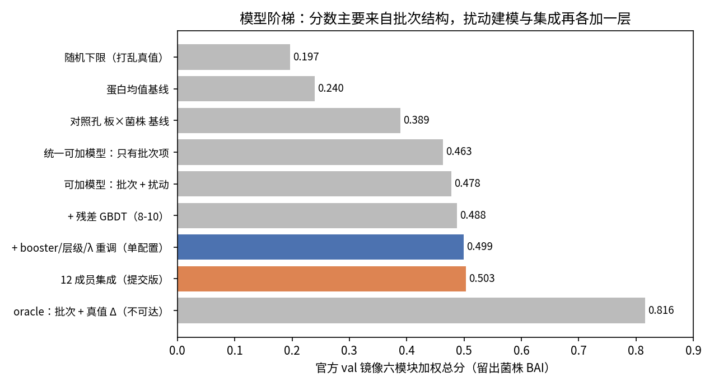
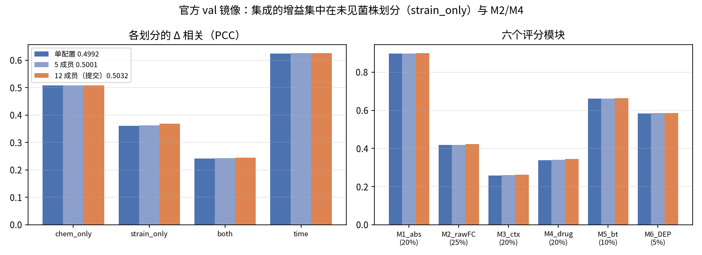
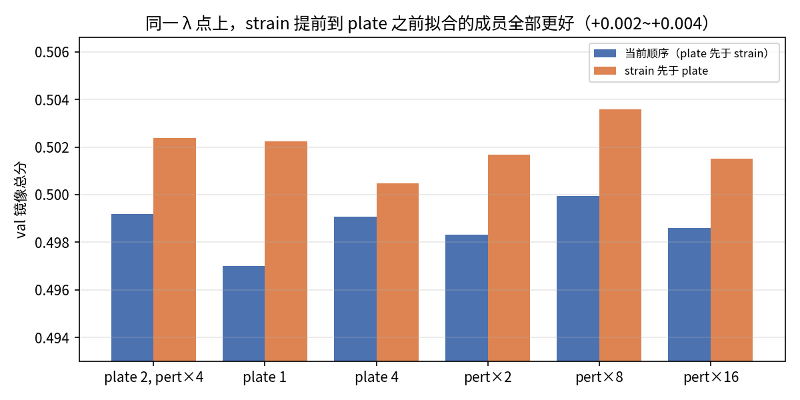
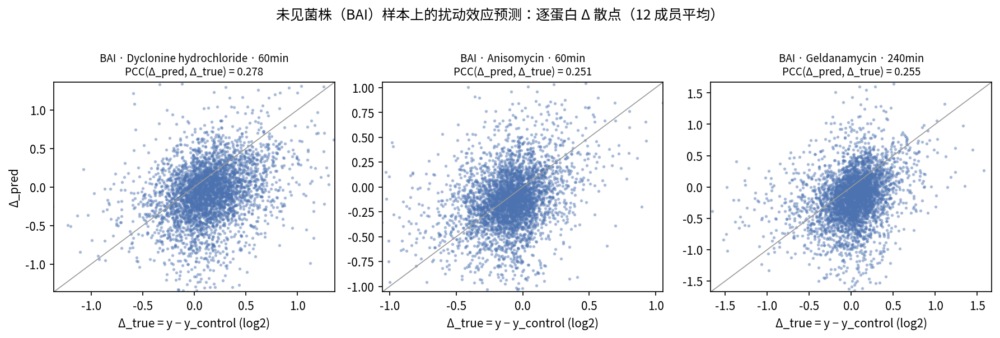

# Demo · 从批次结构到扰动响应：分层收缩回填与残差提升的虚拟酵母模型

GOAI 2026 赛道三 · 方向一（虚拟酵母扰动蛋白质组预测）。本页由 `scripts/61_demo_report.py` 从缓存结果生成，
所有数字可用仓库代码复现（见 [`REPRODUCE.md`](../REPRODUCE.md)）。

## 1. 任务与方案一句话

预测 4,454 个测试样本 × 5,243 个蛋白的 log2 蛋白质组，覆盖未见化合物 / 未见菌株 / 双重未知 / 时间插值。
方案把预测拆成 **批次基线 + 扰动效应** 两部分，用**分层收缩回填**（`vcell/models.py::UnifiedBackfit`）
在 log2 空间统一拟合，再用 **残差 LightGBM**（`ResidualBooster`，残差 PCA 到 240 维后逐维一棵树）吃高阶交互；
最终提交是 **12 个近优配置的等权集成**（两种因子拟合顺序 × 六个 λ 邻域点）。
只用 `split_final=='train'` 的 5,920 行标签拟合；测试集真值文件被隔离，代码层禁读。

```python
um = UnifiedBackfit(batch_factors=BATCH_FACTORS, pert_factors=PERT_FACTORS, n_pass=6).fit(meta, Y_obs, use)
P  = um.predict()                                             # 批次结构 + 扰动效应（可加）
rb = ResidualBooster(n_comp=240, n_estimators=1600, learning_rate=0.015, seeds=[0, 1, 2]).fit(meta, Y_obs, use, P)
Y_hat = P + rb.predict()                                      # 一个集成成员
```

## 2. 分数从哪里来（官方 val 镜像，留出菌株 BAI，只评一次）



| | TOTAL | FC[chem_only] | FC[strain_only] | FC[both] | FC[time] |
|---|---:|---:|---:|---:|---:|
| 单配置 | 0.4992 | 0.5077 | 0.3606 | 0.2419 | 0.6250 |
| 5 成员 λ 邻域集成 | 0.5001 | 0.5082 | 0.3619 | 0.2431 | 0.6258 |
| **12 成员集成（提交版）** | **0.5032** | 0.5090 | **0.3689** | 0.2456 | 0.6266 |



## 3. 为什么是这 12 个成员：一个被否决的"替代方案"是最好的集成成员

把 `strain` 因子提前到 `plate` 之前拟合，作为**替代**时只在 3/6 折上更好（未过线）；
但作为**集成成员**它 6/6 折过线——它的偏差方向与当前顺序不同，正是集成需要的多样性。
在官方 val 镜像上，同一 λ 点的 strain-early 成员**全部**优于当前顺序的成员：



内层六折（与官方结构一致的无孤儿 plate 折，逐折配对，真配置 booster）：

| 比较 | 配对 delta ± sem |
|---|---|
| 5 成员 λ 邻域集成 vs 单配置 A | +0.00097 ± 0.00013（6/6 折） |
| + strain-early 五成员（10 成员）vs 单配置 | +0.00285 ± 0.00078（6/6 折） |
| 12 成员（提交版）vs 单配置 | +0.00322 ± 0.00081（6/6 折） |
| 12 成员 vs 5 成员 | +0.00225 ± 0.00076（6/6 折） |
| 12 成员 vs 10 成员 | +0.00036 ± 0.00017（4/6 折） |

## 4. 未见菌株上的扰动效应长什么样



## 5. 评测审计（方法的另一半）

`vcell/metrics.py` 忠实复现了六个评分模块；`scripts/09_metric_audit.py`、`27_official_baselines.py`、
`30_calibrate_official.py` 用组委会公布的基线数字校准了对齐 / 过滤 / 尺度 / 对照匹配
（蛋白均值基线的 Global R² 与官方最大偏差 0.3%）。审计发现：**同一份预测在不同合理评分读法下总分跨度 0.41–0.57**，
比一切建模改进都大——相关口径问题列在 [`docs/OPEN_QUESTIONS.md`](../docs/OPEN_QUESTIONS.md)。

## 6. 复现

```bash
pip install -r requirements.txt            # Python 3.9, numpy/pandas/scipy/lightgbm, CPU only
# 官方 3 个输入文件放到 data/input/ 后：
for m in A B C D E E16_pert16 F_strain_early FB_early_plate1 FC_early_plate4 FD_early_pert2 FE_early_pert8 FE16_early_pert16; do
  python scripts/57_predict_member.py $m; done
python scripts/58_compose_submission.py --members A,B,C,D,E,E16_pert16,F_strain_early,FB_early_plate1,FC_early_plate4,FD_early_pert2,FE_early_pert8,FE16_early_pert16 --out submission/_candidates/ens12/prediction.csv
python scripts/60_full_feature_contract.py --src submission/_candidates/ens12/prediction.csv --out submission/prediction.csv
```
